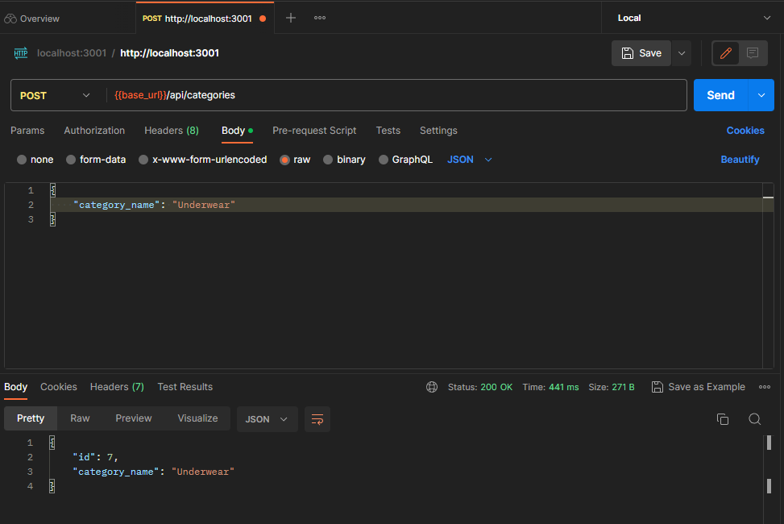
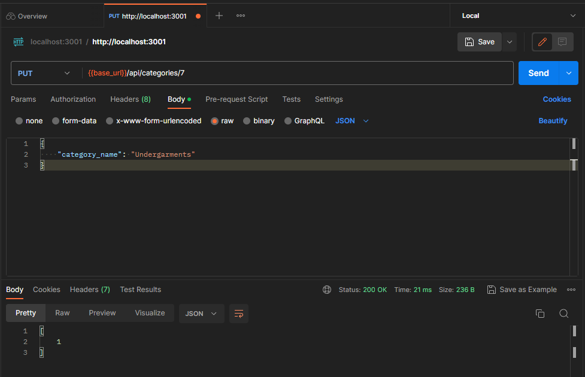

# E-Commerce BackEnd <!-- omit in toc -->

</img>
</img>

 <h2>Dependencies </h2> 

 
 
 
 
 
 

## Table of contents <!-- omit in toc -->

- [Description](#description)
- [Usage](#usage)
- [Mock Up](#mock-up)
- [Credits](#credits)
- [License](#license)
- [Links](#links)

## Description
This application provides the backend infrastructure needed to build an e-commerce platform, including API routes and models for products, categories, and tags.
This application enables product and category management, including CRUD operations, as well as search functionality by tag, product, or category by their respective ID.

## Usage
Follow these steps to get started:
1. Clone the repository to your local machine.
2. Install the required dependencies using the package manager of your choice.
3. Configure the environment variables for the application, such as the database connection details.
4. Run the database migrations to set up the required tables and schema.
5. Start the server.
6. Access the API endpoints using your preferred API development tool or client.

## Mock Up
The following images demonstrate the functionality of the application.

</img>
    <figcaption>GET all categories<figcaption>

</img>
    <figcaption>GET one product<figcaption>

</img>
    <figcaption>PCREATE a category<figcaption>

</img>
    <figcaption>UPDATE a category<figcaption>

## Credits
- Code by: [Daniel Sanchez](https://github.com/Morkendi)
- Starter Cody by: [Tec Bootcamps](https://github.com/coding-boot-camp/fantastic-umbrella)

## License

This project utilizes an MIT License. [Read more](https://choosealicense.com/licenses/mit/)

## Links
- Link to [GitHub repo](https://github.com/Morkendi/E-Commerce)
- Link to [Video Demo]()